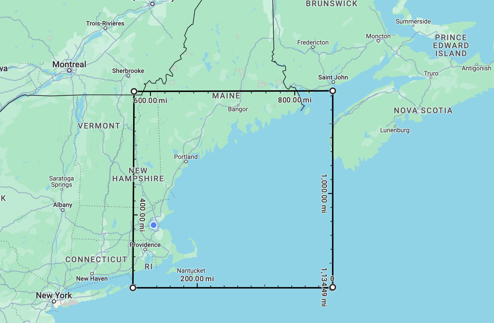

```{r setup, include=FALSE}
knitr::opts_chunk$set(echo = TRUE)
library(tidyverse)
library(MuMIn)
library(rgbif)
library(data.table)
library(ggmap)
library(knitr)
library(lubridate) # Useful functions for dealing with dates
library(tidync) # For easily dealing with NetCDF data
library(rerddap) # For easily downloading subsets of data
library(sf) # For spatial matching
library(rgeos) # Ibid
library(ggOceanMaps) # Great for ocean maps
#devtools::install_github("MikkoVihtakari/ggOceanMapsData") # required by ggOceanMaps
library(foreach) #for faster sf computing
library(doParallel) # ibid
```

# Introduction:

Shark migration patterns are incredibly important for the survival and the health of marine ecosystems. Aside from serving as 'flagship species' that facilitate the raising of awareness and financial support for conservation of coral reefs and marine life, sharks also operate as top predators that can initiate trophic cascades according to @HEITHAUS2008202. Trophic cascades are vital for controlling relative populations of other species down the food chain and therefore affect the natural sources of food--often related directly to health and biodiversity of the entire ecosystem.

However, rising surface water temperatures, a stark reality of climate change, has already significantly affected marine life. Previous research has established the undeniable link between warming waters and altered shark behavior. Studies by @Pistevos2015 suggest that growing ocean acidification and global warming can impair shark hunting and growth, potentially resulting in dangerous trophic cascades. This can have potentially catastrophic implication for regions where water is heating up significantly year to year. For example, the New England region recorded warming water temperatures up to 3 degrees Fahrenheit since 1901 according to @Peery2019.

There is little understood about the migratory patterns of sharks in the northeastern regions as temperature of water rise. Which begs the question: How exactly does surface water temperature influence shark migration patterns? In order to answer this question we combined observed data of shark migratory patterns over time with information about temperature of water over a specified area of the Northeastern region. Using statistical analysis we were able to observe the impact of drastically increasing water temperatures on shark behavior across 10 different species in order to understand the universal relationship on shark behavior.


# Methods:

The area of interest, encompassing approximately the Gulf of Maine region, was identified and then delineated using the 'measure a distance' tool in Google Maps. This defined four sets of latitude and longitude coordinates, which were subsequently rounded to the nearest integer for ease of analysis. Occurrence data from the Global Biodiversity Information Facility (GBIF) was filtered to obtain all human Elasmobranchii observations in the area of interest between 2000 and 2023, then further filtered to include migratory shark species. [...]

Sea surface temperature data was retrieved from the National Oceanic and Atmospheric Administration (NOAA)'s Optimum Interpolation Sea Surface Temperature (OISST) dataset by Dr. Kenaley, extracting data from the region of interest. 

# Results:

## 1. Identifying Species and Area of Interest:
```{r area of interest, echo = FALSE, message = FALSE, warning = FALSE}

name <- c("low_left","top_left","top_right","low_right")
lat <- c(41.02923, 45.11812, 45.11812, 40.99269) %>%
  round()
long <- c(-71.72927, -71.74585, -66.06430, -66.12886) %>%
  round()
area_coords <- data.frame(name,lat,long)

kable(area_coords, caption = 
        "Table 1: Rounded Coordinates for Region of Interest")
```



The region of interest was identified as approximately the Gulf of Maine, as visible in Figure 1. 

```{r finding potential migratory species, include = FALSE}

potspp <- occ_data(scientificName = "Elasmobranchii", 
                   basisOfRecord = "HUMAN_OBSERVATION", 
                   year = "2000,2023",
                   decimalLatitude = "41.0,45.0", 
                   decimalLongitude = "-72.0,-66.0", 
                   )[[2]]

scientific_name <- c("Cetorhinus maximus", "Isurus oxyrinchus","Mustelus canis","Lamna nasus","Squalus acanthias","Carcharias taurus","Carcharinus plumbeus","Carcharodon carcharias","Prionace glauca","Carcharinus obscurus")
common_name <- c("basking shark", "shortfin mako", "smooth dogfish","porbeagle","spurdog","sand tiger shark","sandbar shark","white shark","blue shark","dusky shark")
migspp <- data.frame(scientific_name,common_name)

kable(migspp, caption = 
        "Table 2: Migratory Shark Species in the Area of Interest")
```

Occurence data indicated that a number of shark species have been identified in our region of interest since 2000. Using information from the National Oceanic and Atmospheric Administration, we can narrow down the list of species to those that exhibit migratory behavior between the area of interest and the mid-Atlantic/Southeast waters (@NOAAmigration).


## 2. Spatial Analysis of Shark Migration

The observations were further filtered by months during which sharks migrate into the area, namely during late spring to late summer (we specified between May and October agccording to @NOAAmigration). 

```{r cache=FALSE}
spp <- c("Cetorhinus maximus","Isurus oxyrhinchus","Mustelus canus", "Lamna nasus", "Squalus acanthias", "Carcharias taurus", "Carcharhinus plumbeus", "Carcharodon carcharias", "Prionace glauca", "Carcharhinus obscurus")
y <- paste0("2000",",","2023")
m <- paste0("5",",","10")

dat.l <-list()

for(s in spp){
  n.obs <-  occ_data(scientificName = s, year = y, month = m, limit = 1000, country="US", basisOfRecord = "HUMAN_OBSERVATION")$meta$count 

dat.l[[paste0(s)]] <- occ_data(scientificName = s,year=y,month=m,
                               limit=1000, country="US",
                               basisOfRecord = "HUMAN_OBSERVATION", 
                               decimalLatitude = "41.0,45.0", 
                               decimalLongitude = "-72.0,-66.0", 
                   )[[2]]

}

dat <- rbindlist(dat.l,fill=T)
```


```{r, cache = T}
# The information for the NOAA OISST data
rerddap::info(datasetid = "ncdcOisst21Agg_LonPM180", url = "https://coastwatch.pfeg.noaa.gov/erddap/")


if(T){ #if you want to run this, change F to T
  
OISST_dat <- griddap(datasetx = "ncdcOisst21Agg_LonPM180", 
                       url = "https://coastwatch.pfeg.noaa.gov/erddap", 
                       time = c('2016-01-01','2022-12-31'), 
                       zlev = c(0, 0),
                       latitude = c(41, 45),
                       longitude = c(-72, -66),
                       fields = "sst")$data 
    
  saveRDS(OISST_dat,"GoM_SST.RDS") 
}


OISST_dat <- readRDS("GoM_SST.RDS")
sst2 <- OISST_dat %>% 
  mutate(time = as.Date(stringr::str_remove(time, "T12:00:00Z"))) %>% 
  rename(
    decimalLongitude=longitude,
    decimalLatitude=latitude
  )
  
dat2 <- dat %>% 
  mutate(date= as.Date(stringr::str_remove(eventDate, "T.*"))) %>% 
  select(species,date,individualCount,decimalLatitude,decimalLongitude) %>% 
  mutate(individualCount=ifelse(is.na(individualCount),1,individualCount))

sst2 %>% 
  select(decimalLongitude,decimalLatitude) %>% 
  unique %>% 
  ggplot(aes(decimalLongitude,decimalLatitude))+geom_point()+geom_point(data=dat2)


#for a date, pull the sst from closest coordinate
closest_sst <- function(x,y=sst_sf,date){
  y2 <- y %>% filter(date==date) 
  d <- st_distance(x, y2$geometry)
  return(y2[which.min(d),] %>% pull(sst))
}

dat_sf <- st_as_sf(dat2, coords = c('decimalLongitude', 'decimalLatitude'), crs = 4326)

sst_sf <- st_as_sf(sst2, coords = c('decimalLongitude', 'decimalLatitude'), crs = 4326)

#could take a very long time!!!
dat_sf2 <- dat_sf %>% 
  mutate(record=1:n()) %>% 
  group_by(record) %>% 
  mutate(
    sst = closest_sst(x=geometry,date=date)
)

dat_sf2 %>%
  ggplot(aes(sst,individualCount))+geom_point()


## Parrallelize this

cl <- makePSOCKcluster(detectCores()-2) # leave two cores for background processes


ptm <- proc.time()
d <- foreach(i=unique(dat_sf$species), .combine = rbind, .packages=c("tidyverse","sf") ) %dopar%  {

dat_sf %>%
    filter(species==i) %>% 
  mutate(record=1:n()) %>% 
  filter(record<101) %>% #omit this line to do all records of all species
  group_by(record) %>% 
  mutate(
    sst = closest_sst(x=geometry,date=date)
) 
}
proc.time() - ptm
stopCluster(cl)

  #374 species took 3000 s. Be aware!!
 # user   system  elapsed 
 #   4.807    4.095 3012.390 

#plot
gom <- basemap( limits=c(-71, -66, 41, 45))
gom+geom_sf(data=d ,aes(col=sst))+facet_wrap(.~species)
```

# Discussion:

## References
